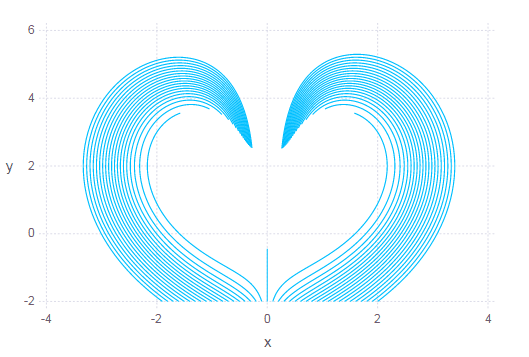

# Package of Dynamic Systems
This Package is a toolbox for Analyzing Dynamic Systems.

## Introduction of .jl files
Plotting : ``DynamicSystemPlot.jl`` is for visualization of a 2-D dynamic system, based on ["Gadfly"](http://dcjones.github.io/Gadfly.jl/index.html)

## Usage
### Plotting
All args of ```DynamicSystemPlot``` function are:
```
dyn::DynamicSystem
npoint=100                # How many points do you want to plot in each path.
npath=20                  # How many path do you want to plot in this graph.
resol=0.01                # How "long"(time step) is each point to the next point.
width=0.05                # How wide is the initial point of each path to the next one(along +x direction).
start_time=0,			  # How much time do you want to delay before plotting.
rk4_npoint=100			  # How many times do you want RungeKutta-4 to compute for each point.
option="s"                # Another option is  option = "PNG", to creat a .PNG file of this graph.
```
#### Example
**The Dynamic system is:**

$f(\begin{bmatrix}
	     	x \\ y
	     	\end{bmatrix} )=\begin{bmatrix}
	     	\dot{x} \\ \dot{y}
	     	\end{bmatrix} = \begin{bmatrix}
	     		     	2x-xy \\ 2x^2-y
	     		     	\end{bmatrix}$ and $x_0 = \begin{bmatrix}
	     	-2\\ -2
	     	\end{bmatrix} $

**The codes are:**

```
julia> function f(x)
       return [2*x[1]-x[1]*x[2];2*x[1]*x[1]-x[2]]
       end
f(generic function with 1 method)

julia> include("DynamicSystemPlot.jl")
DynamicSystemPlot(generic function with 1 method)

julia> Dy = DynamicSystem(f,[-2;-2])
DynamicSystem(f,[-2,-2])

julia> DynamicSystemPlot(Dy , npoint = 180, npath = 40, resel = 0.01 , width = 0.1)
```

